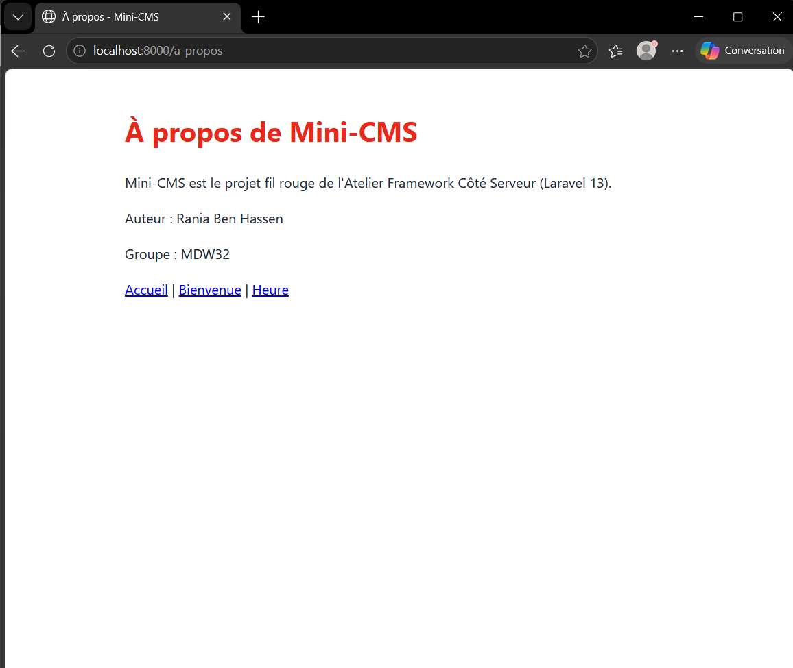

# Mini-CMS

Projet fil rouge de l'Atelier Framework Côté Serveur (Laravel 13, PHP 8.3+), 3e année MDW, ISET Sidi Bouzid.

Auteur : Rania Ben Hassen, groupe MDW32.

Mini-CMS évoluera au fil du semestre vers une petite plateforme de publication : pages publiques, back-office authentifié, API JSON et tests Pest. Chaque session se termine par un tag Git (`lab-01`, `lab-01b`, puis un tag par session).

## État actuel (tag lab-01b)

-   Routes en closures : `/`, `/bonjour`, `/bonjour-court`, `/bienvenue`, `/version`, `/heure` et `/a-propos`.
-   Vues Blade : `bienvenue`, `heure` et `a-propos`.
-   Base de données SQLite locale (`database/database.sqlite`, non versionnée).

## Routes disponibles

| Méthode | URI              | Réponse                                                                |
| ------- | ---------------- | ---------------------------------------------------------------------- |
| GET     | `/`              | Vue `welcome` (page d'accueil par défaut de Laravel)                   |
| GET     | `/bonjour`       | Chaîne de texte « Bonjour MDW3 ! Voici ma première route Laravel 13. » |
| GET     | `/bonjour-court` | Chaîne de texte, écrite avec une fonction fléchée                      |
| GET     | `/bienvenue`     | Vue `bienvenue` avec le nom de l'étudiant, le groupe et le cours       |
| GET     | `/version`       | Chaîne avec la version de Laravel et celle de PHP                      |
| GET     | `/heure`         | Vue `heure` avec l'heure (format H:i) et la date (format d/m/Y)        |
| GET     | `/a-propos`      | Vue `a-propos` avec le nom de l'auteur et le groupe                    |

## Prérequis

-   PHP et Composer (PHP 8.3 ou plus depuis https://www.php.net/downloads, avec les extensions curl, fileinfo, mbstring, openssl, pdo_sqlite, sqlite3 et zip activées dans php.ini, et Composer depuis https://getcomposer.org).
-   Node.js LTS et npm.
-   Git.

## Installation

### Bash (Git Bash, macOS, Linux)

```bash
git clone https://github.com/raniabn149-rgb/mini-cms.git
cd mini-cms
composer install
npm install
cp .env.example .env
php artisan key:generate
touch database/database.sqlite
php artisan migrate
composer run dev
```

### PowerShell (Windows)

```powershell
git clone https://github.com/raniabn149-rgb/mini-cms.git
cd mini-cms
composer install
npm install
copy .env.example .env
php artisan key:generate
New-Item database\database.sqlite -ItemType File
php artisan migrate
composer run dev
```

Ouvrir ensuite http://localhost:8000 (adresse de l'application, différente de l'adresse de Vite sur le port 5173).

## Captures d'écran

### Page d'accueil


### Page Bienvenue


### Liste des routes


### Page À propos


